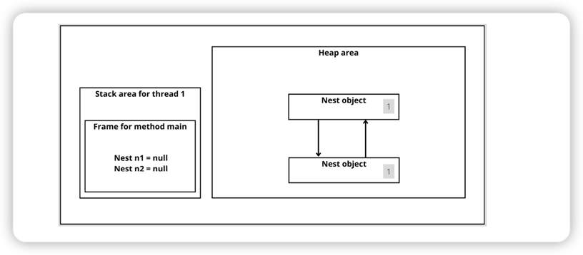

# Garbage Collection Algorithm 


## Being eligible for GC 

Objects on the heap are no longer needed when they don't have a connection to the stack.

```java

// create object, and stored in the heap
// variable "o" holds a reference to an object of type "Object" on the stack.
Object o = new Object();

System.out.println(o);

// variable "0" set to null, nothing else in our application holds a reference to the Object we've created.
// it becomes eligible for GC.
o = null;
```

## Island of isolation



Both objects are unreachable from stack. But both would still have **1** if we would use the 
counting of references.

## Different type of GC 


### Generational GC 

Generational GC focus on a certain part of memory, for example, the young generation.
This approach would work well for applications that have most of their object die young.

### Serial GC 

The serial GC runs on a single thread and ues the stop-the-world strategy. 
This GC is ideal for small application, but for large applications such as **spring**
or **Quarkus** programs, there's better solution. 

### Parallel GC 

The parallel garbage collector is default GC of Java 8. It uses the mark-and-copy approach 
in young generation and copy-and-compacting approach for the old generation. The parallel 
garbage collector works well in multi-cores machine, whilst serial GC is a better choice 
on single core machine.


### CMS GC 

https://docs.oracle.com/javase/8/docs/technotes/guides/vm/gctuning/cms.html


### G1 GC 

https://www.oracle.com/technetwork/tutorials/tutorials-1876574.html

### Z GC 

https://docs.oracle.com/en/java/javase/11/gctuning/z-garbage-collector1.html
