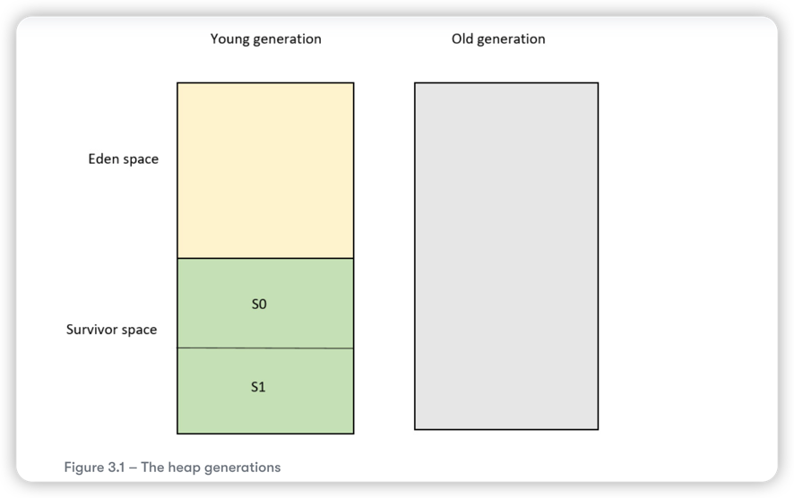
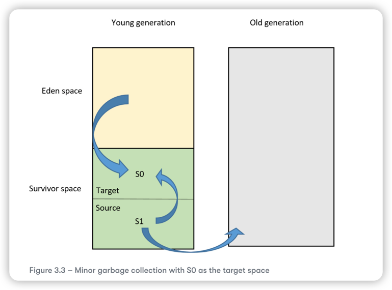
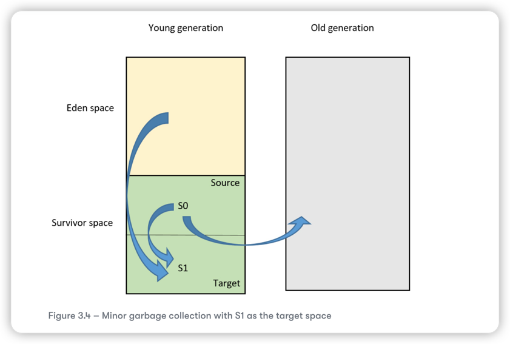
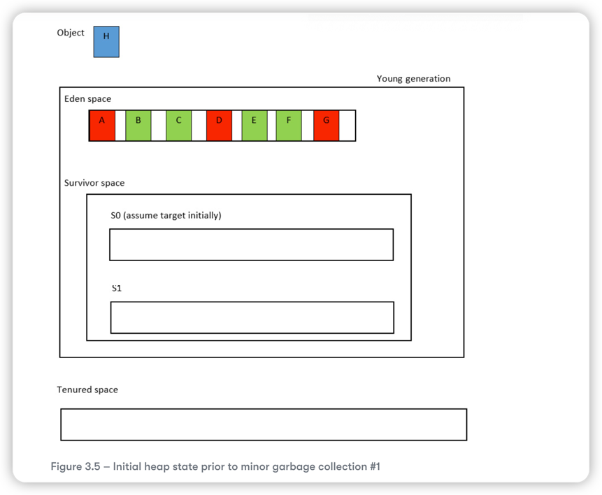

# Heap space

## Garbage collection roots 

A GC root is a special type of live object and is, therefore, not eligible for GC. All objects reachable from GC roots are also live and 
are, therefore, not eligible for GC. The GC roots act as starting points in GC, that is, start at these roots and mark all object 
reachable as live. The most common GC roots are the following:

* Local variable on the stack 
* All active Java threads
* Static variables (as these can be referenced by their classes)
* Java Native Interface(JNI) references 

* Young generation space: contains two separate ares
  * Eden space: New objects are allocated in the eden space. When the eden space is full and there is no room for allocating a new object, the young generation(**minor**) garbage collector runs
  * Survivor space: There are two equally survivor space, namely S0 and S1. The minor garbage collector uses these regions in an alternate fashion. 
* Old generation space: This is also known as **tenured** space. In other words, the garbage collector moves object that have survived a certain number of GCs here. When the tenured space becomes full, this triggers a **major** GC.

**Given-When-Then scenario**

* Given: **S0** as the target survivor and **S1** as the source survivor spaces initially
* When: Minor garbage collector runs. In other words, the eden space does not have enough space for an object that the JVM wishes to allocate
* Then: 
  * All live objects from the eden space are copied to the **S0** survivor space. The ages of those objects are set to `1`, as they have just survived their first GC cycle
  * **S1** is examined and any live objects whose ages meet a given threshold(the **tenuring threshold**) are copied to the old generation space, meaning they are tenured. In other words, this is a long-lived object, so copy it to the old generation area where longer-lived objects reside. This makes future minor GC runs more efficient as it ensures these same objects are not reexamined.
  * The remaining live **S1** objects (the ones that were not tenured) are copied to **S0**, where their ages are incremented by one, as they have just passed another GC cycle.

Note that the tenuring threshold is configurable using a JVM argument, **--XX:MaxTenuringThreshold**. In effect, this flag allows you to customize how many GC cycles an object will stay in the survivor space before it finally gets tenured into the old space.
Be careful with this argument, as a value greater than 15 specifies that object should never tenure, thereby indefinitely filling up the survivor space with old objects. 

To summary:

* Copy live eden objects to S0 (age set to 1)
* Copy old, live S1 objects to long-generation space
* Copy young, live S1 objects to S0 (ages incremented)

target survivor space S1:
* Eden space -> S1
* examine S0
  * Copy tenured object to old generation space 
  * Copy remained object to S1
  * reclaimed
vice versa.

## minor garbage collection algorithm 

* Red objects have no references to them from the GC roots. They are eligible for GC. 
* Green objects are live objects, meaning they are GC roots or can be reached via GC roots. These objects are not eligible for GC. 
* White spaces are gaps in the eden space. If there is enough contiguous space to allocate the object, then the object is stored in eden, and its reference is returned. If, however, due to memory fragmentation, there is not enough contiguous space to allocate the object, a minor(young generation) GC is triggered.

The survivor space consists of the following:

* S0 - empty initially; we will assume that the JVM is using this as the target survivor space initially
* S1 - Also empty initially; as SO is the target space, S1 becomes the source space(as there is nothing in S1 initially, this has no effect the first time around)

The tenured (old generation) space consists of long-lived objects. Long-lived objects are objects that have survived a certain predefined number of minor GC. This is a customizable threshold value using the -XX:MaxTenuringThreshold JVM argument.

## Some JVM flags

* **-Xms** and **-Xmx** specify the heap's minimum and maximum sizes, respectively.
* **-XX:NewSize** and **-XX:MaxNewSize** specify the young generation's minimum and maximum sizes, respectively
* **-XX:SurvivorRatio** specifies the relative sizes of the two survivor spaces with respect to the edge space. For example, **-XX:SurvivorRatio=6** sets the ratio between eden and a survivor space to 1:6
* **-XX:NewRatio** expresses the relative size of the new generation with respect to the old generation. For example, **-XX:NewRatio=3** sets the ratio between new generation and old generation to 1:3.
* **-XX:PretenureSizeThreshold** - If an object's size is greater than the size specified by this flag, then the object is tenured immediately, meaning the object is allocated straight to the old generation space. By default value is 0, which means no object will be directly allocated to the old generation of the heap.

In general, keep the young generation space between 25% and 33% of the total heap size. This ensures that the old-generation space is always larger. This is desirable because full GCs are more expensive than minor ones.
