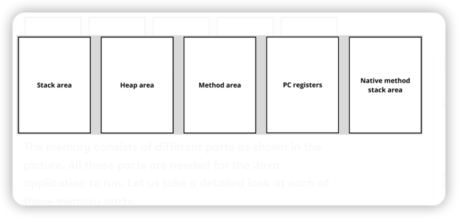
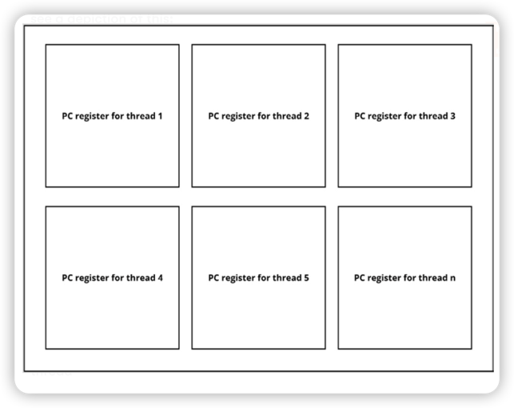

# Java virtual machine basic

## Components in JVM for memory management 

* class loader: to load all the classes 
* runtime data areas: storing the class data
* execution engine: executes the bytecodes 

## Runtime data area 

### Heap 

When the JVM starts, it reserves a piece of the RAM for the Java application to use 
for dynamic memory allocation. This memory is called the heap. This is the area where 
the runtime data is stored. Class instances can be found on the heap. The JVM takes care
of assigning space to the heap and cleaning it up with a process called garbage collection.

### Stack 

The stack, or more precisely, the JVM stack, is where the primitives and pointers to the heap are stored.
For every method that is called, a frame gets created on a stack and this frame also holds the values for this 
method, such as partial results and return values.

There is not just one stack. Every thread in the application has its own thread. 

### Method area (Metaspace)

The method area is where the runtime representation of classes is stored. The method area
contains the runtime code, static variables, constants pools, and constructor code. To summary,
this is where the class's metadata is stored. All threads share this method area.

### PC register

The Program Counter(PC) register knows what code is being executed by holding the address
of the instruction that is being executed in its thread.

Every thread has its own PC register, sometimes also referred to as the call stack. 
It knows the sequence of statements that needs to be executed and which one it is executing currently.

## Native method stack 

There's also a native method stack, also known as a C stack. it is there for the native 
code that is executed. Native code is part of the implementation that is not written in Java,
but for example, in C.

## Primitives and reference types 

Primitive and reference variables are stored on the stack. The actual object
is stored on the heap.

## Stack 
If the stack memory is too small to store what is needed for the frame, **StackOverFlowError**
is thrown. When there is not enough space for a new stack for a new thread, **OutOfMemoryError** 
is thrown. The method that currently is being executed by a thread is called 
the current method and its data is held in the current frame.

