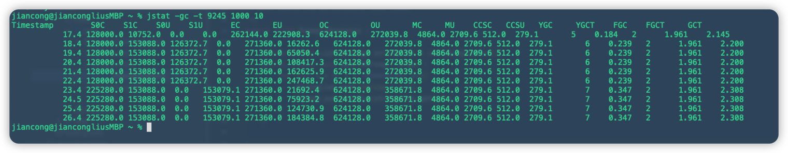
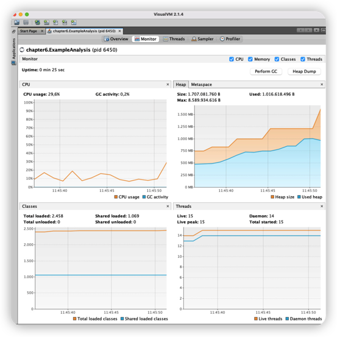

# JVM configurations

There is not one obvious way to configure the JVM. The best configuration really depends on the application and the
requirements.
Getting the best configuration will improve the performance of your application and minimize the memory requirements.
Monitoring
performance and memory will help discovery problems before users do.

```java
/**
 * This sample code is for the GC analysis.
 * Using VisualVM to grab the JVM metrics.
 *
 * You can launch the application with different heap size to
 * experiment what will happen when heap size running out of space  and
 * what would the GC activity look like.
 */
public class ExampleAnalysis {

    public static List<String> stringList = new ArrayList<>();

    public static void main(String[] args) {
        for (int i = 0; i < 1000000000; i++) {
            stringList.add("String " + i);
            System.out.println(stringList.get(i));
        }
    }

}
```

```shell
# compile java file
javac ExampleAnalysis

# execute java.class
java ExampleAnalysis

# find the java process
jps

# use jstat to analyze GC status, as img_10.pgn shown
jstat -gc -t 9245 1000 10
```



* **Timestamp**: The time since the program started running. You can see that it increases with seconds, which makes
  sense, as we asked for iterations of 1,000 milliseconds.
* **S0C**: The current capacity of the survivor space 0 in KB.
* **S1C**: The current capacity of the survivor space 1 in KB.
* **S0U**: The part of the survivor space 0 that is being used in KB.
* **S1U**: The part of the survivor space 1 that is being used in KB.
* **EC**: The current capacity of the Eden space in KB. You can see that the capacity scales up when the Eden space gets
  fuller.
* **EU**: The part of the Eden space that is being used in KB. At the seventh row, it drops, and the data gets moved to
  the old space.
* **OC**: The current capacity of the old space in KB.
* **OU**: The part of the old space that is being used in KB. You can see it increase during the program.
* **MC**: The current capacity of the Metaspace in KB.
* **MU**: The part of the Metaspace that is being used in KB.
* **CCSC**: Compressed Class Space Capacity in KB.
* **CCSU**: Compressed Class Space Utilized in KB.
* **YGC**: The number of young generation garbage collection events that happened.
* **YGCT**: The total time of the young generation garbage collection events.
* **FGC**: The total number of full garbage collection events.
* **FGCT**: The total time the full garbage collection events took.
* **CGC**: Concurrent Garbage Collection.
* **CGCT**: The total time of concurrent garbage collection.
* **GCT**: The total garbage collection time.

You also can use VisualVM to profiling the application.



## Useful JVM flags

* **java -XX:+PrintFlagsFinal -version | grep HeapSize** : get default heap size. The heap size can be changed. In
  general, the best practice is to not set the heap size more than half of what is available on the server.
* **-Xms1024m** : set initial heap size to 1024m
* **-Xmx1024m** : set maximum heap size to 1024m
* **-Xss1024**  : set thread stack size
* **-XX:MaxNewSize=1024m** : set maximum size for young generation
* **-XX:NewSize=1024m** : set minimum size for young generation
* **-XX:+HeapDumpOnOutOfMemoryError -XX:HeapDumpPath=/some/path/to/dumps** : tell JVM to generate dump file when OOM
  happens, also specifies the file path
* **-XX:MaxMetaspaceSize=2048m** : as name describe
* **-XX:MetaspaceSize=1024m** : threshold to trigger a run of garbage collector
* **-XX:MinMetaspaceFreeRatio=50 and -XX:MaxMetaspaceFreeRatio=50** set ratio of Metaspace
