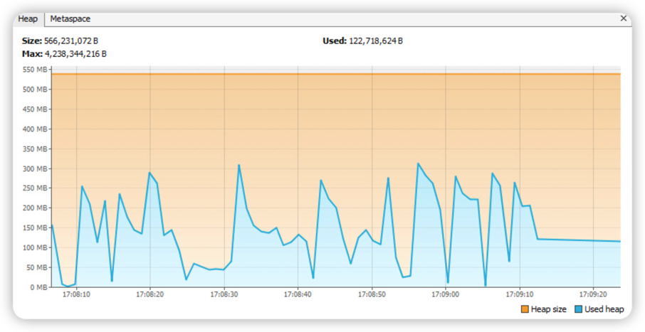
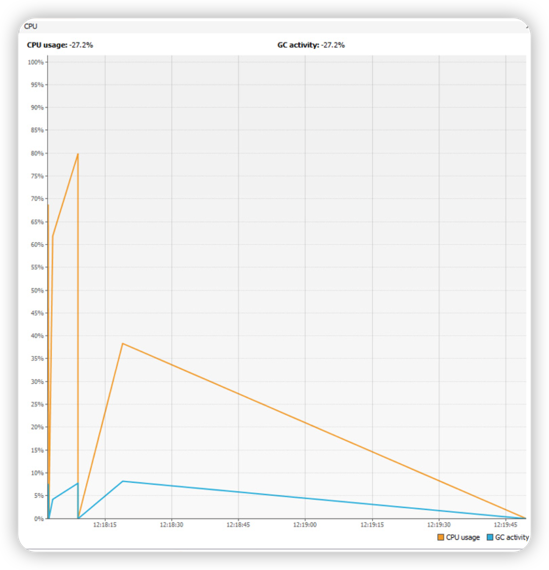

# Memory Leak 

Memory leak happens when objects that are no longer needed are not freed up. This causes these
objects to accumulate in memory. Give that, the memory is a finite resource, this can eventually 
result in your application slowing down or even crashing(with an out-of-memory error).

The following metrics would be helpful in diagnosing the application:
* Heap memory footprint
* Garbage collection activity 
* Heap dump 

A classical memory leak signal is that GC activity is showing it's busy and the memory does not reclaim.

