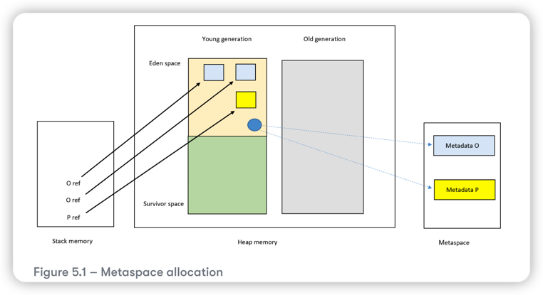

# Metaspace 

The metaspace is a special area of native memory area outside of the heap. Native memory is memory 
provided by the operating system to an application for its own use. The JVM uses the metaspace 
to store class-related information, that is the class runtime representations(class metadata).

In Java 8 onwards, the amount of memory allocated for the Metaspace is unbounded by default. You can use 
`–XX:MetaspaceSize`(this is to set the **high-water-mark**)to customize the size for Metaspace. If you run out of memory, you get an OOM message,
and this will trigger a run of the garbage collector. You can limit the Metaspace size with the JVM flag
`–XX:MaxMetaspaceSize`. If you reach this limit, that will also trigger a run of the garbage collector.

* XX:MetaspaceSize --> set high-water mark
* "–XX:MinMetaspaceFreeRatio and –XX:MaxMetaspaceFreeRatio" --> set the high-water-mark dynamically 

Above two sets of flag have more or less the same functionality, depends on your usecase.

**high-water mark** is the signal to trigger a run of garbage collector when the Metaspace reaches a certain threshold.

## Class loading

When a class is accessed for the first time(for example, when an object of the class is created), the class loader 
locates the class file and allocates its metadata in the Metaspace. The class loader owns this allocated Metaspace 
and the class loader instance itself is loaded onto the heap. Once loaded, subsequent references reuse the meatadata
of that same class.

There are two class loaders worth mentioning at this point: the **bootstrap class loader** (which is responsible for loading 
the class loaders themselves) and the **application class loader**. Both of these class loaders' metadata reside permanently 
in Metaspace and consequently, are never garbage collected. **Dynamic class loaders** (and the classes they load) are, 
on the other hand, eligible for garbage collection.

## Metadata 

Metadata is information about data. Like, columns in database are metadata about the data in the column. Thus, 
if a column name is **Name**, and the specific row's value is **John**, then **Name** is metadata about **John**.

In java, class metadata consists the following:

* Class files
* Structure and methods of the class
* Constants
* Annotations
* Optimizations

## Garbage collection of the Metaspace

As the class loader owns the metadata for a class, the garbage collector can only reclaim this metadata when the class loader
itself is dead. The class loader is only dead when there are no instances of any classes loaded by that loader.

